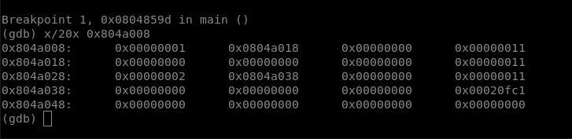

# LEVEL 7

What we want:
- use strcpy for the exploit
- replace the call to puts by a call to m()

4 malloc are done in a row, so the buffers are sequentially put in the heap.

Since we have to strcpy, the first one is a key and the second one is the value :
- we overflow the first strcpy in order to change the value of the 2nd strcpy's buffer. Instead of the address of a malloc'd buffer, it will be the address of the entry for puts in the got
- for the 2nd strcpy, we just have to write the address of the m function into the got entry
- then after fgets copies level8/.pass into c, the call to puts will be repaced by a call to m, in which c is printed

